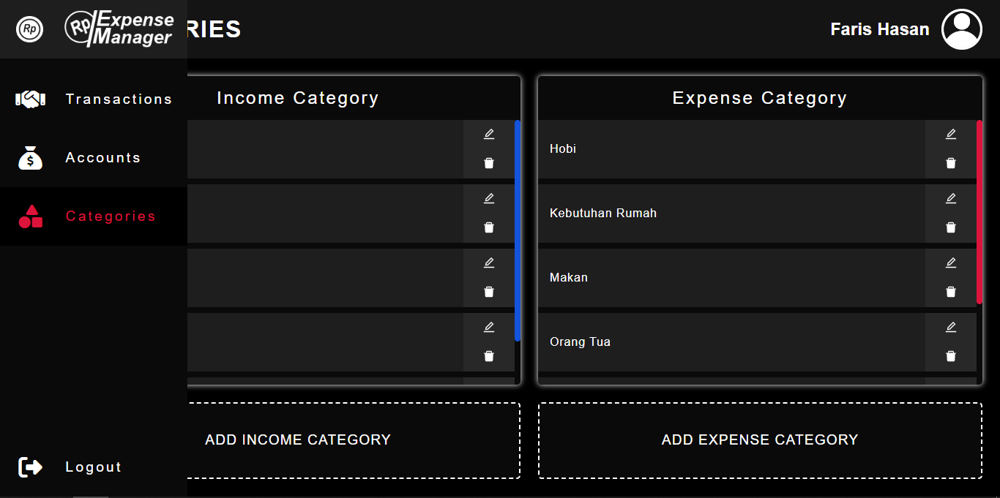
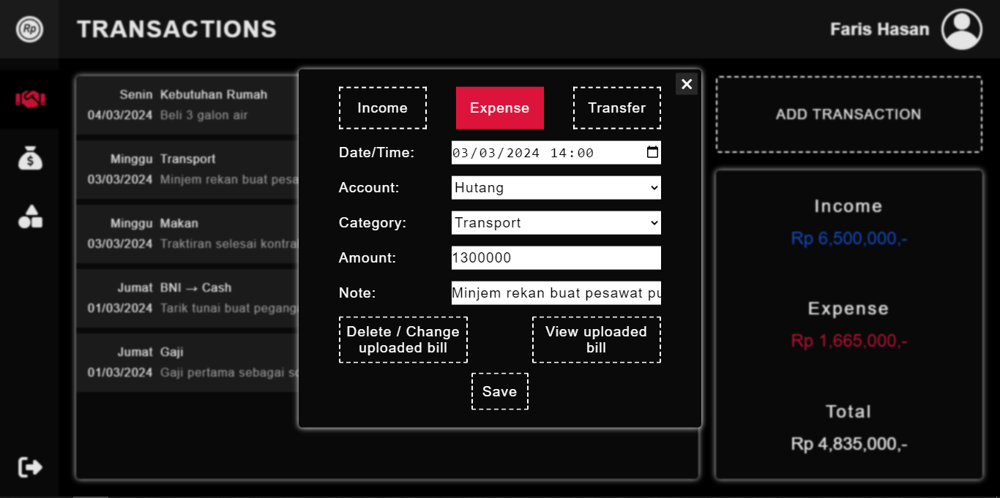
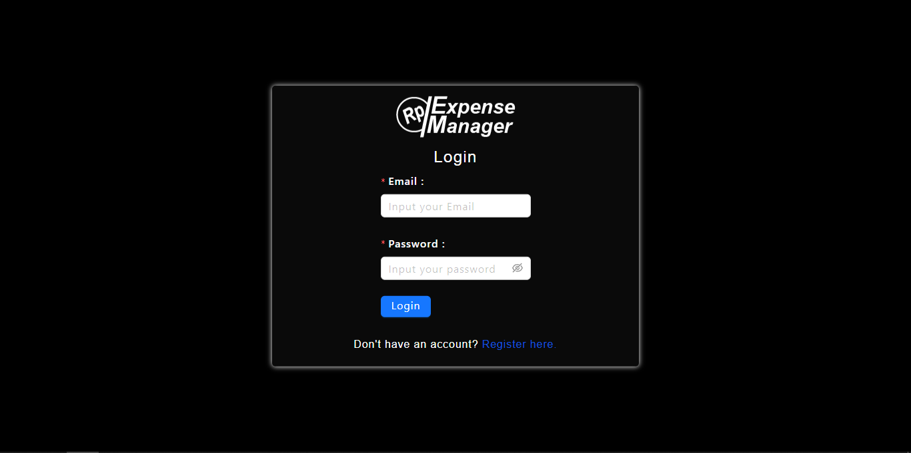

# Expense Manager

Expense Manager adalah aplikasi web-based untuk membuat dan menyimpan catatan harian transaksi uang.

* Untuk melihat website, lihat disini https://expensemanager.biz.id
* Untuk repository live client, lihat disini https://github.com/sanfarish/EMclient

* Untuk melihat api, lihat disini https://api.expensemanager.biz.id/api/v1/docs (dokumentasi)
* Untuk repository live server, lihat disini https://github.com/sanfarish/EMserver

## Feature

* Mencatat transaksi dengan waktu harian, sampai hitungan menit.
* Dibagi menjadi 3 jenis transaksi, yaitu pemasukan (income), pengeluaran (expense), dan transfer antar akun.
* Memperlihatkan jumlah total transaksi baik pemasukan maupun pengeluaran.
* Memperlihatkan jumlah total saldo akun baik aset (assets) maupun beban (liabilities).
* Saldo akun otomatis bertambah/berkurang seiring adanya transaksi.
* Pemasukan dan pengeluaran dibagi menjadi tiap-tiap kategori untuk memudahkan pencatatan.

### New Feature

* Live online dengan personal domain dan vps agar bisa digunakan semua orang
* Fungsi register dan login agar data tiap user berbeda-beda
* Warna tampilan lebih nyaman di mata (dark)
* Tampilan responsif bisa dibuka dari hp (minimum width 320px)
* Unggah foto bill anda untuk memaksimalkan pencatatan (gambar disimpan di Cloudinary dan bisa di unduh)

## Getting Ready (local app)

Untuk mencoba menjalankan aplikasi secara lokal, pastikan komputer sudah terinstall:
* Git version 2.43.0.windows.1
* Node.js v20.12.0
* PostgreSQL 16.2

Sebelum instalasi, jalankan kode tersebut di command prompt:
```bash
git clone
cd /server
npm i
cd ../client
npm i
```

## Installation

### Start Server
Pertama, masukkan file .env ke folder /server, file .env ada di link berikut:
https://drive.google.com/file/d/1FPFsrLZPCxrlsrCwGoURWkyMl_a-H10y/view?usp=drive_link

Lalu tuliskan kode dibawah:
```bash
cd /server
npx knex migrate:rollback
npx knex migrate:latest
npx knex seed:run
npm start
```

### Start Client
Untuk menjalankan development build, ketikkan kode dibawah:
```bash
cd /client
npm start
```

Untuk menjalankan production build, ketikkan kode dibawah:
```bash
cd /client
npm run build
npm run preview
```

## Usage
* Buat, modif, dan hapus kategori di halaman Categories.
* Buat, modif, dan hapus akun di halaman Accounts.
* Buat, modif, dan hapus transaksi di halaman Transactions.
* Untuk unggah gambar, silahkan tambahkan gambar saat membuat transaksi.
* Untuk unduh gambar, silahkan klik `edit` pada transaksi yang sudah ada gambarnya, klik `view transaction bill`, lalu klik saja gambarnya, maka akan diarahkan ke link download gambar.

## Screenshots








## Contributors
* Faris Hasan (Project lead & testing division)
* Mariana Djum (UI and logic function division)