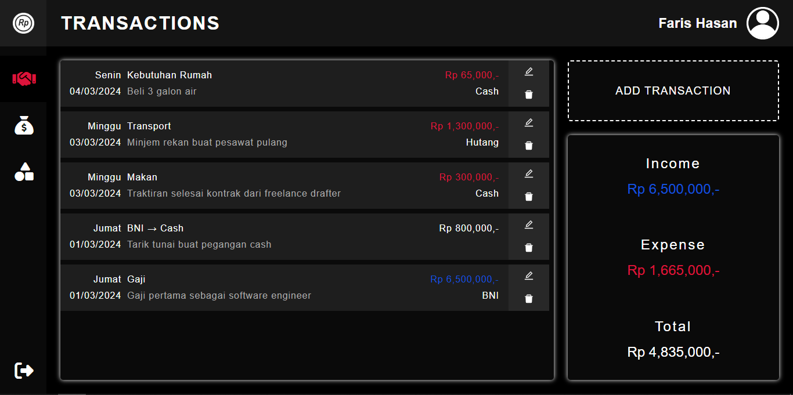
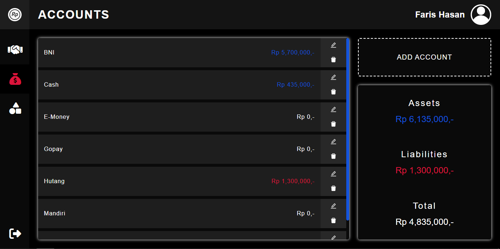
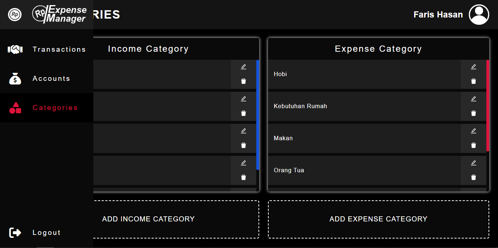
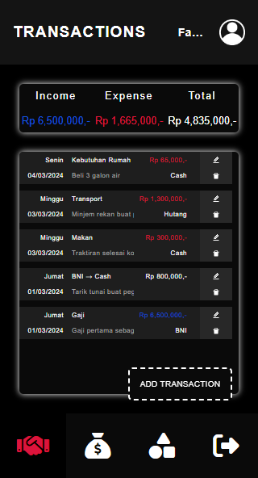
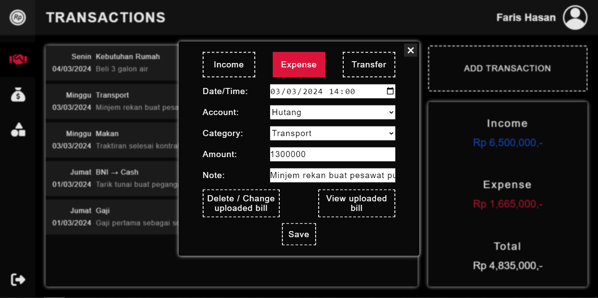
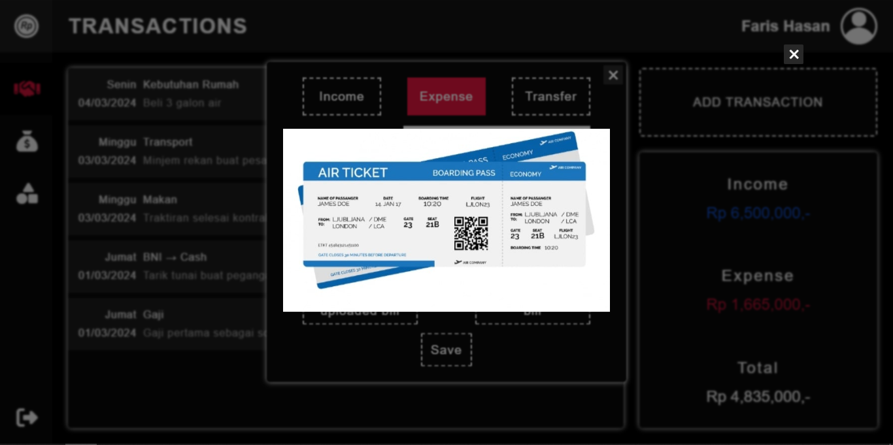
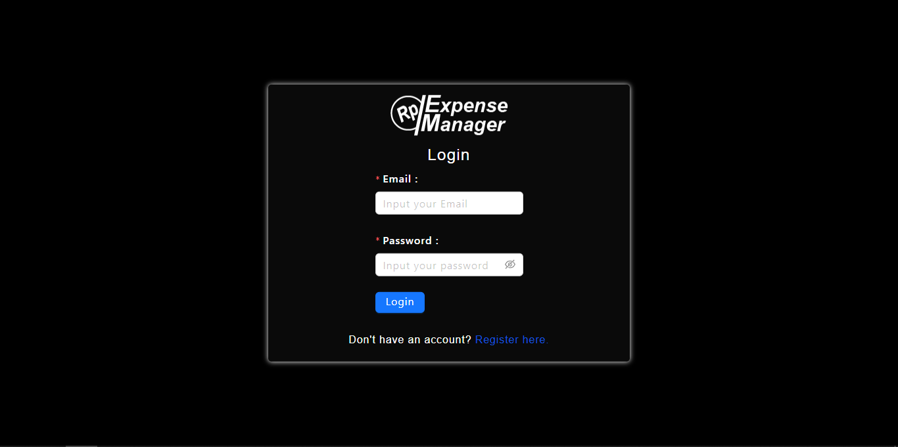

# Expense Manager

Expense Manager is a web-based app to track daily money expense. It allows users to add, edit, delete and view expenses. The app also provides a summary of total expenses.

* Link to deployed web: https://expensemanager.farishasan.web.id
* Link to deployed API: https://expensemanager.farishasan.web.id/api/v1/docs (documentation)

* [ FOR RECRUITER ]: For easy access, please login with email: `faris@mail.com` and pass: `faris`.

## Contributors
* Faris Hasan (Project lead & backend division)
* Mariana Djum (UI & frontend division)

## Tech Stack used
### Full Javascript language project
### Frontend:
* React + Vite
* React Router
* ANT Design + CSS3 for UI
### Backend:
* Node.js + Express
* Postgres
* Knex as ORM
* JWT for authentication
* Cloudinary for image storage (upload/download)
### Testing with Jest
### Deployment:
* Ubuntu VPS + Nginx web server
* GitHub Actions for CI/CD

## Feature
* Mencatat transaksi dengan waktu harian, sampai hitungan menit.
* Dibagi menjadi 3 jenis transaksi, yaitu pemasukan (income), pengeluaran (expense), dan transfer antar akun.
* Memperlihatkan jumlah total transaksi baik pemasukan maupun pengeluaran.
* Memperlihatkan jumlah total saldo akun baik aset (assets) maupun beban (liabilities).
* Saldo akun otomatis bertambah/berkurang seiring adanya transaksi.
* Pemasukan dan pengeluaran dibagi menjadi tiap-tiap kategori untuk memudahkan pencatatan.
* Live online dengan personal domain dan vps agar bisa digunakan semua orang.
* Fungsi register dan login agar data tiap user berbeda-beda.
* Warna tampilan lebih nyaman di mata. (dark)
* Tampilan responsif bisa dibuka dari hp. (smallest width 320px)
* Unggah foto bill anda untuk memaksimalkan pencatatan. (gambar disimpan di Cloudinary dan bisa di unduh)

## Usage
* Create your own category in `Categories` page.
* Create your accounts in `Accounts` page.
* Then, create and manage your expenses in `Transactions`.
* You can upload bills/pics when creating/editing a transaction.
* You can view and download uploaded bills/pics when editing a transaction.

## Screenshots

